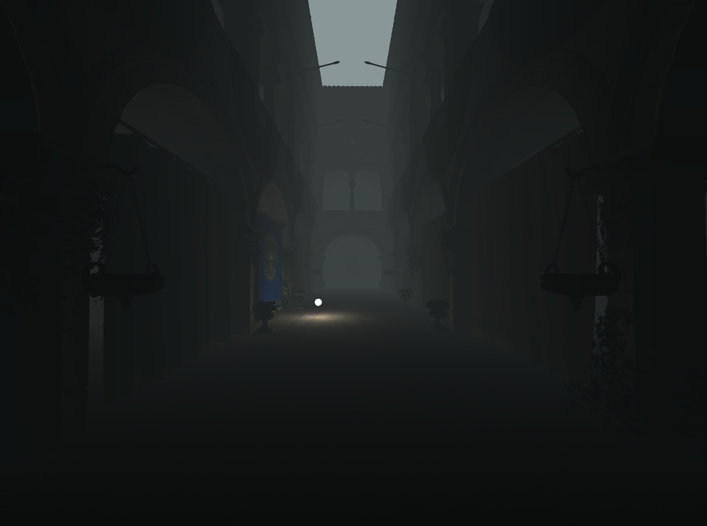
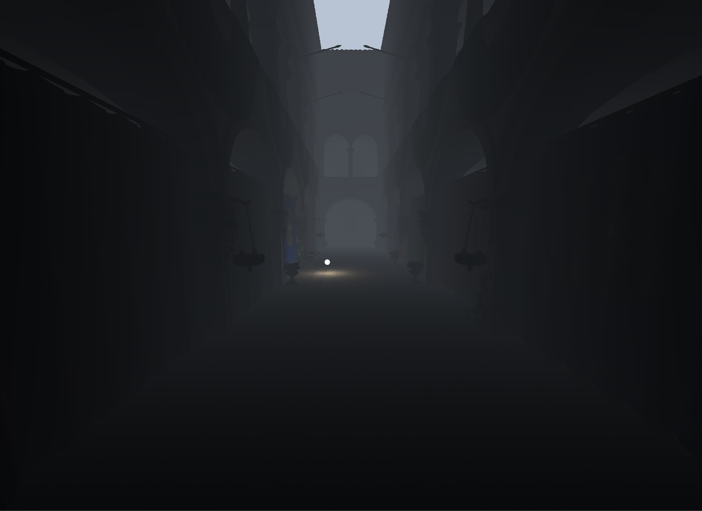
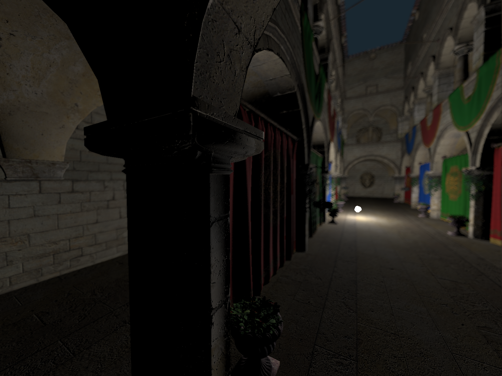
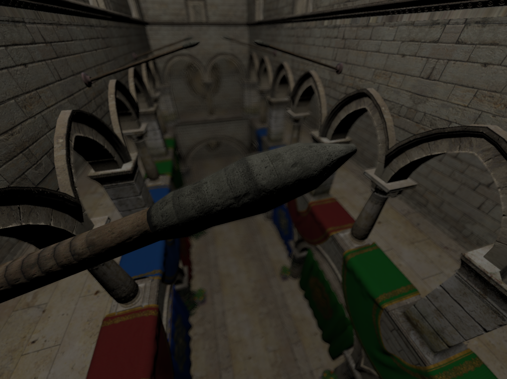
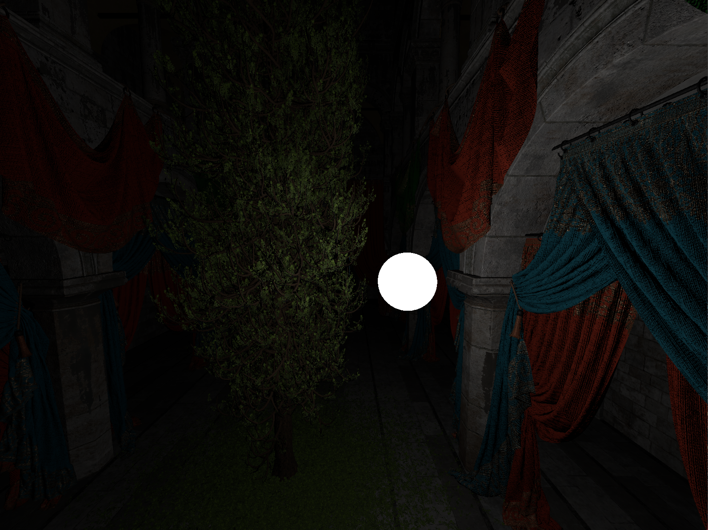
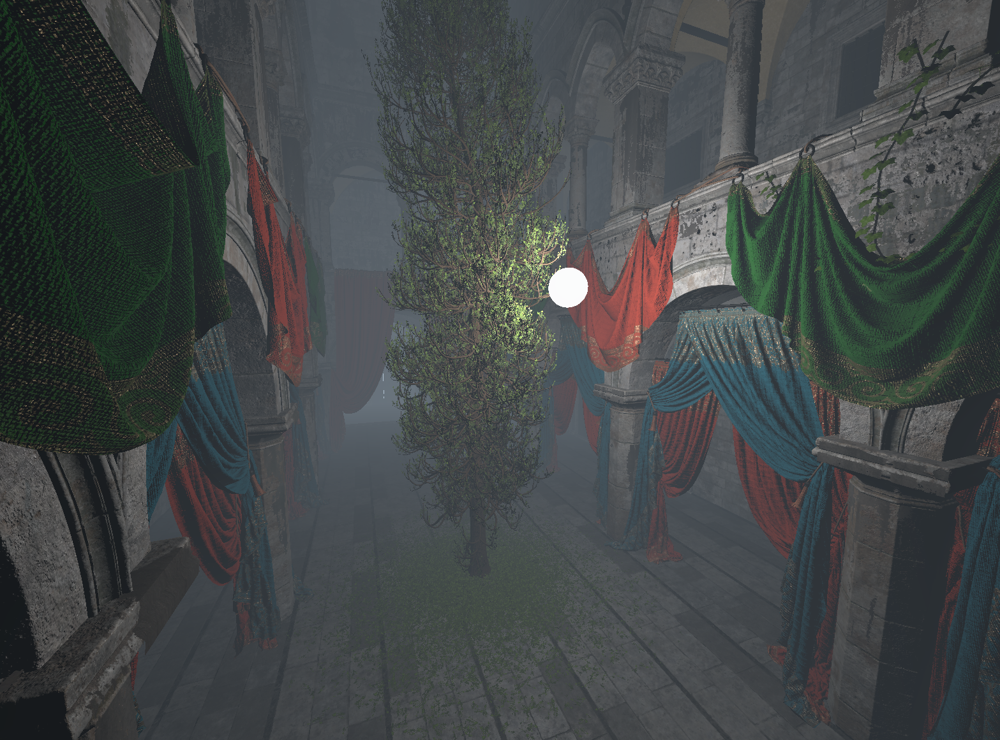
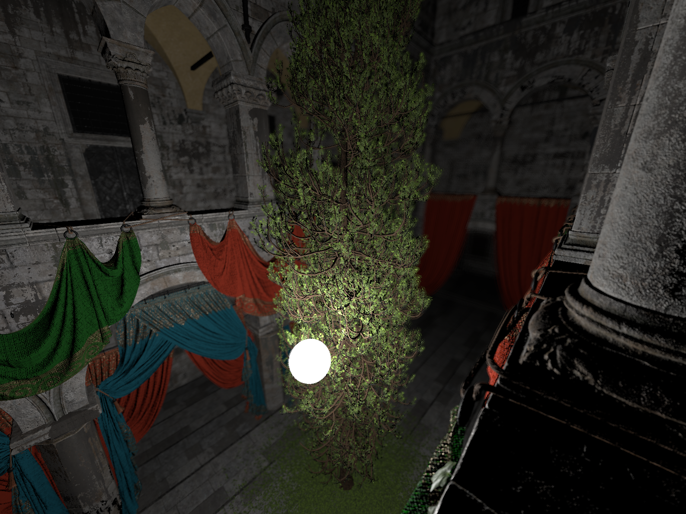

# 🔥Teleios Engine — DirectX 12 Engine
<div align="center"> 
   
  <br>
  <br>
  <b>Futuristic DirectX 12 engine optimized for performance, modern rendering techniques, and advanced visual effects.</b> 
</div>


## 🎯 Vision

This engine is designed for:

- Exploring low-level graphics workflows and resource management in DirectX 12.
- Rapid prototyping of real-time visual effects with high flexibility.
- Learning to design modular, scalable rendering pipeline.


## 🚀 Properties:

- **Scalable Structure** - Engine is carefully organized for clarity and maintainability, making it easy to extend and scale.  
- **Modern & Physically Based Rendering** - Fully supports metalness-roughness PBR, and handles complex scenes like Intel Sponza.
- **Dynamic Shader System** - Shaders are generated on-the-fly using macros, allowing flexible “one-shader-fits-all” workflows.
- **Global Bindable List** - Every Bindable has its own ID and is assigned to global table, which allows us to share them between objects.
- **Post-Processing** - Editable effects like Depth of Field and Fog.
- **Shader Model 6.8 Ready** - Supports the latest DX12 features including wave operations, typed UAV loads, and advanced root signatures.
- **Compute Shaders** - Leveraging compute shaders to perform advanced GPU-side calculations.

## 📸 Gallery:


<div align="center"> 
   Old Sponza with Fog<br>
    
    
</div>


<div align="center">
   Old Sponza with Depth of Field <br>
    
    
</div>


<div align="center">
   New Sponza with Fog & Depth of Field<br>
    
    
    
</div>

## 📁 Project Overview

```
Build/         # Build directory
Dependencies/  # Runtime DLLs that project depends on
Models/        # Models that will be drawn
Showcase/      # Images made inside the engine
├─ Src/        # Engine's code
├─ System/                # Platform abstraction
├─ Graphics/              # All about graphics engine
│ ├─ Core/                # Graphics engine plumbing
│ ├─ Data/                # CPU-side data handlers
│ ├─ Bindables/           # Bindables we use for rendering
│ ├─ Resources/           # GPU resource wrappers
│ ├─ FullscreenPasses/    # Fullscreen rendering passes
│ └─ Imgui/               # ImGui integration
├─ Scene/       # scene handling and objects
│ └─ Objects/   # objects that can be drawn
├─ Shaders/     # HLSL shaders
├─ Error/       # Error handling
├─ Includes/    # Global includes
└─ Macros/      # Global macros
```

## 🎨 Samples
### Intel Sponza
- Scene from Intel’s graphics research sample repository  
- Demonstrates: lighting, PBR materials, fog, and depth of field
- Source: [Intel Sponza](https://www.intel.com/content/www/us/en/developer/topic-technology/graphics-research/samples.html)
- Screenshots included in `Showcase/` folder

## 🛠 Dependencies

### [ImGui](https://github.com/ocornut/imgui) & [Freetype](https://github.com/freetype/freetype)
- Imgui built in separate project -> single `.lib`  
  - Faster builds  
  - No imgui warnings  
- Freetype required by my ImGui config

### [DirectXTK](https://github.com/microsoft/DirectXTK) & [DirectXTex](https://github.com/microsoft/DirectXTex)
- Must use `*_Desktop_2022_Win10.sln`
- Build **x64 Debug/Release** -> produces `.lib` files

### [Assimp](https://github.com/assimp/assimp)
- Get pre-built binaries from Assimp itch.io
