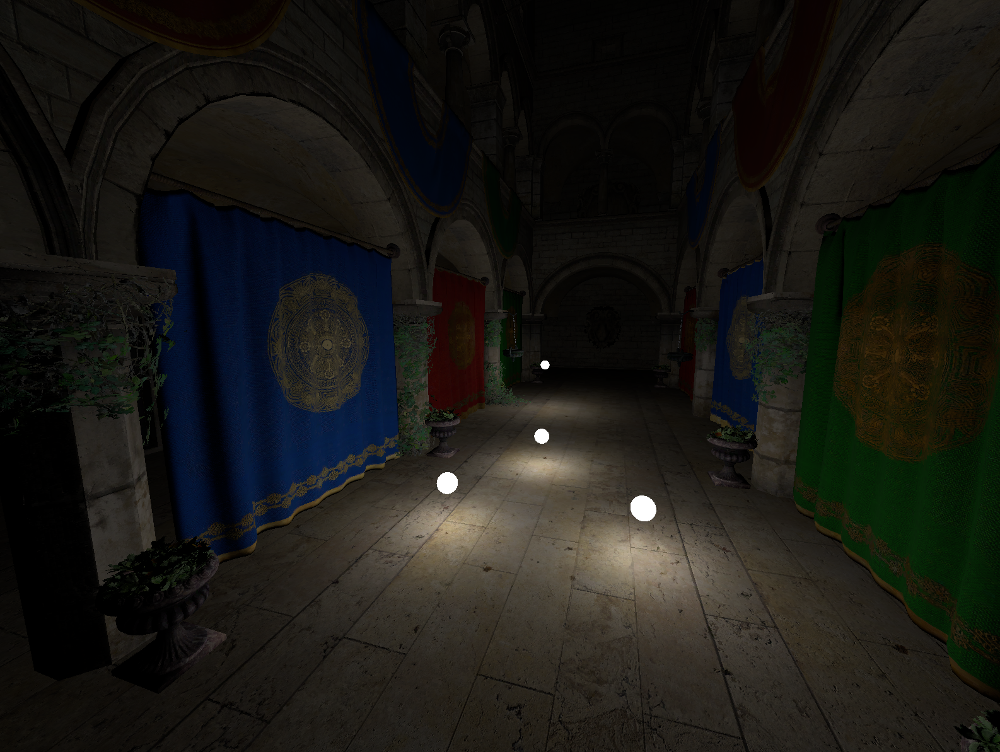
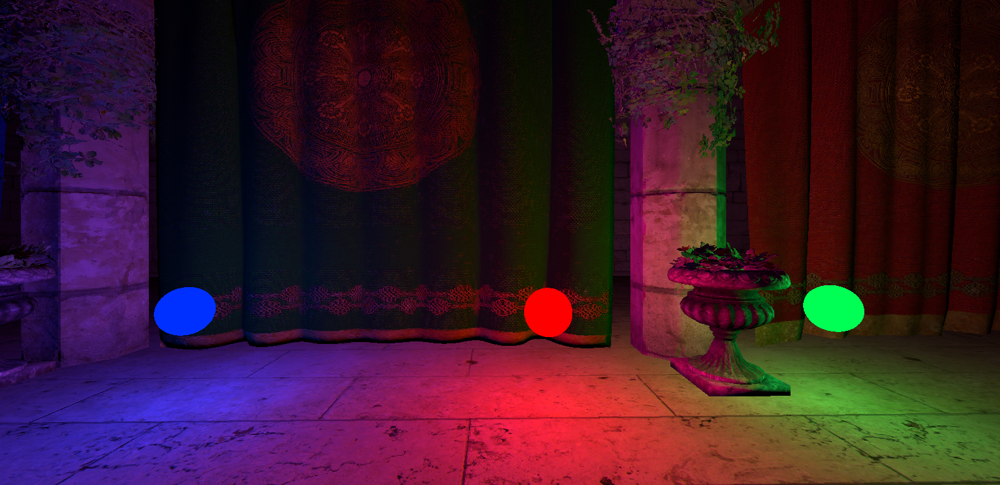
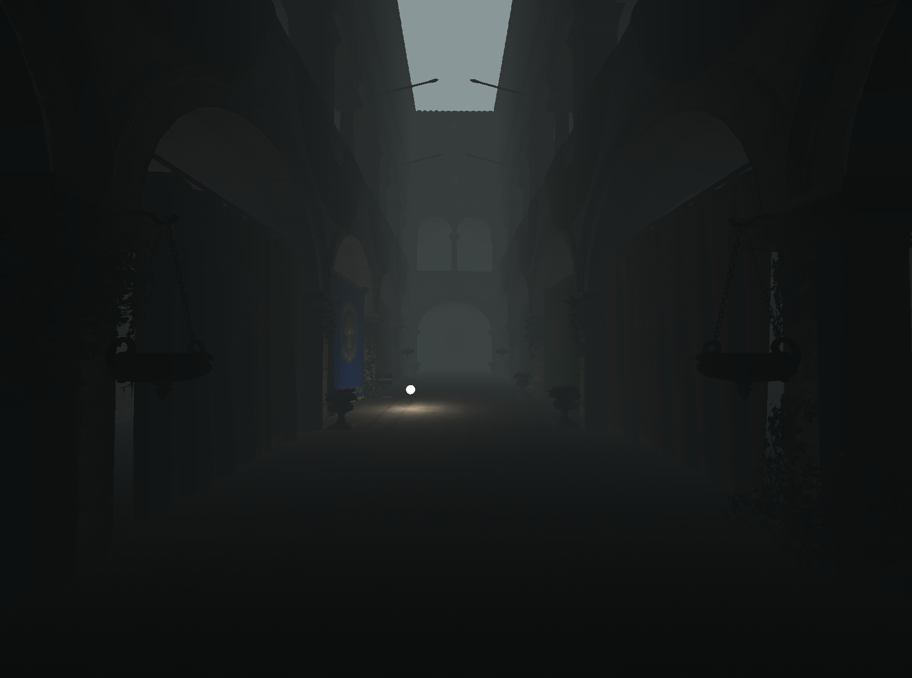
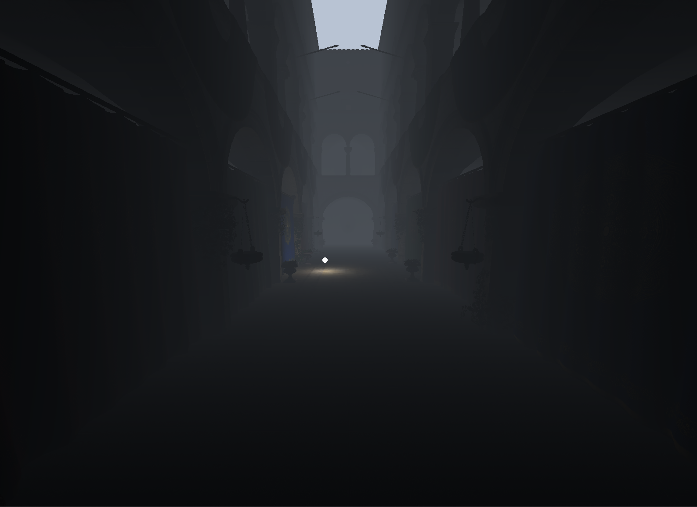
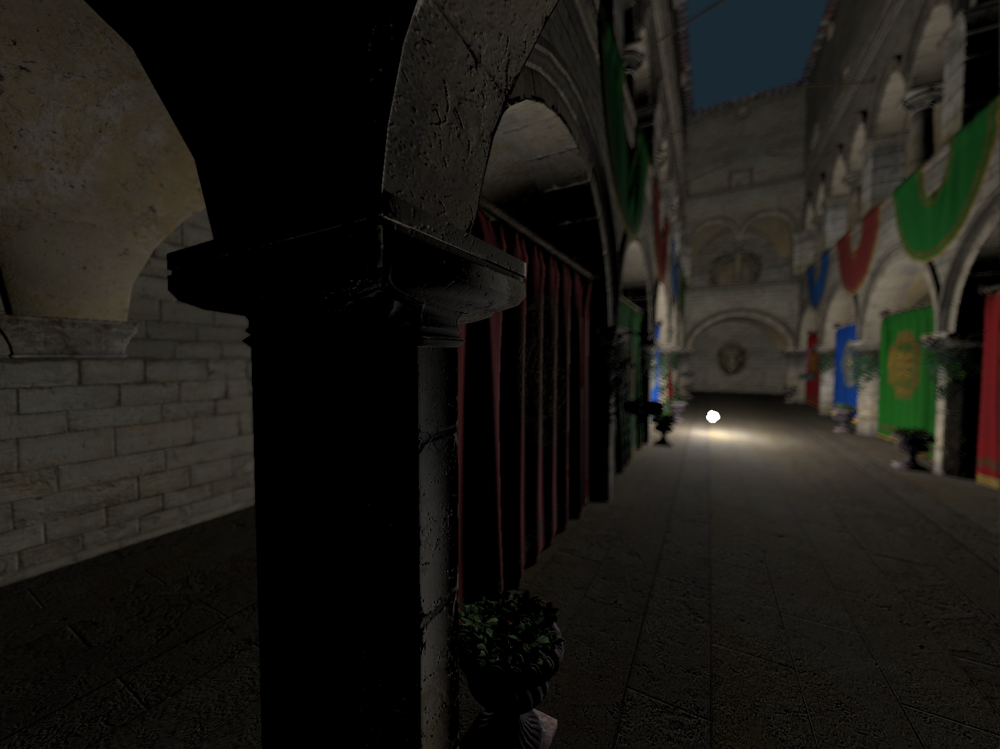
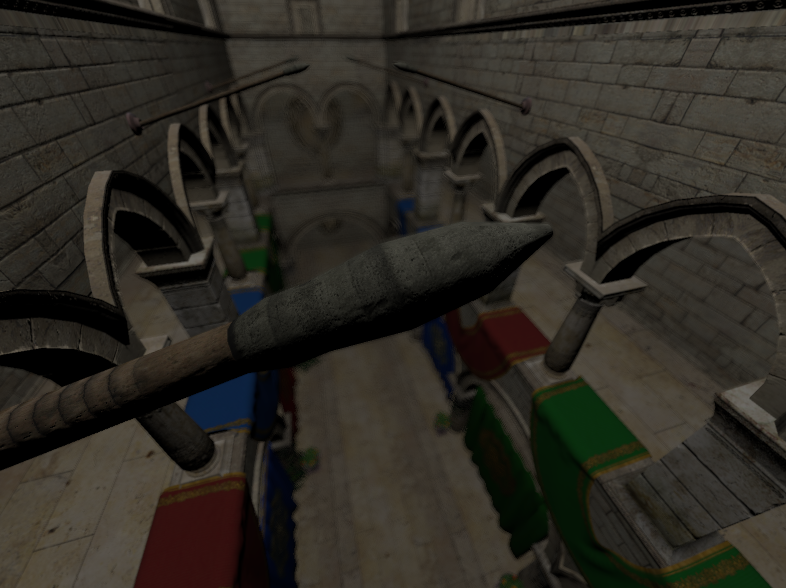
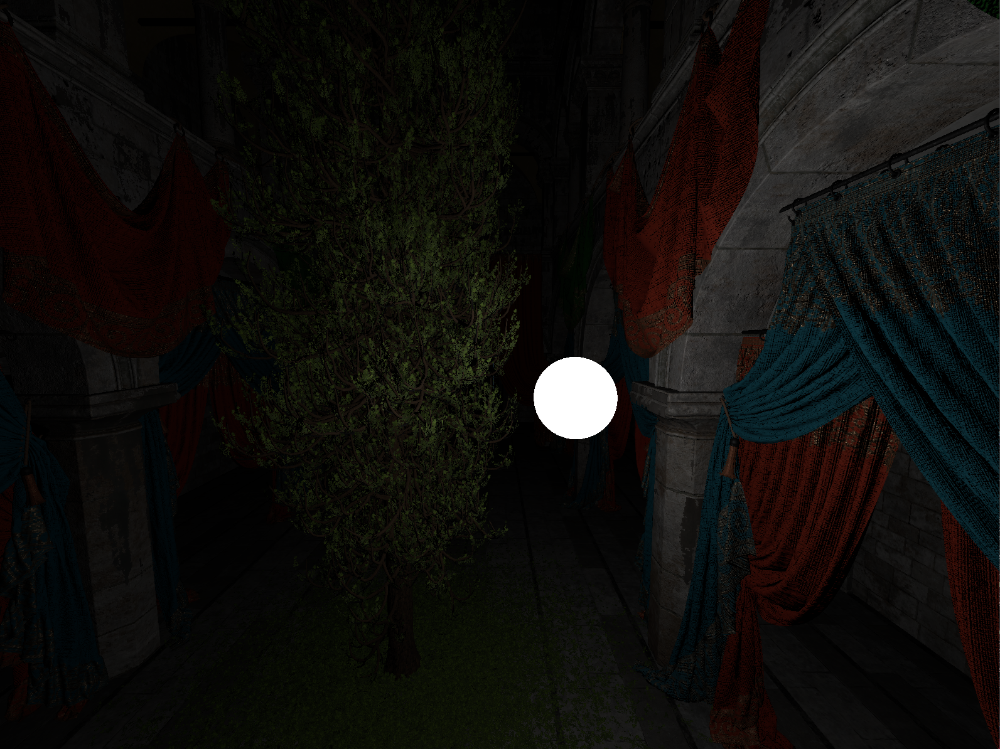
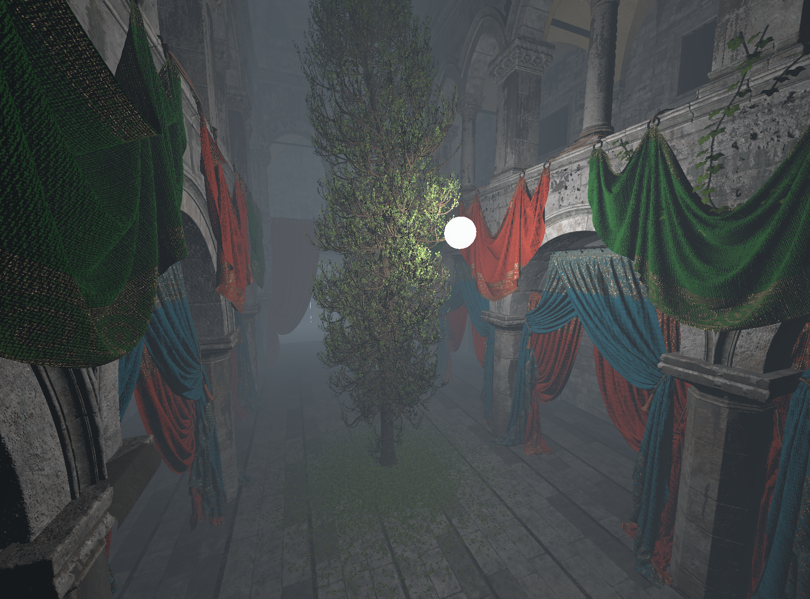
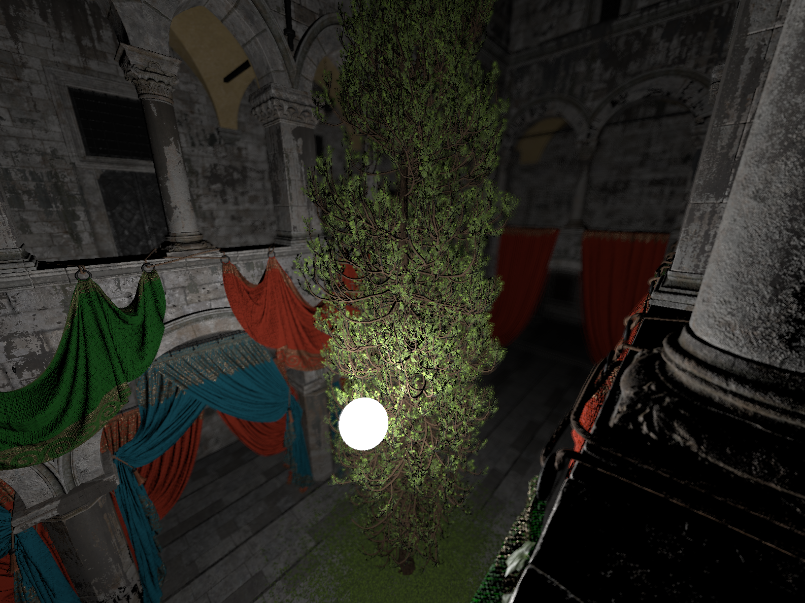

# 🔥Teleios Engine — DirectX 12 Engine
<div align="center"> 
   
  <br>
  <br>
  <b>Futuristic DirectX 12 engine optimized for performance, modern rendering techniques, and advanced visual effects.</b> 
</div>


## 🎯 Vision

This engine is designed for:

- Exploring low-level graphics workflows and resource management in DirectX 12.
- Rapid prototyping of real-time visual effects with high flexibility.
- Learning to design modular, scalable rendering pipeline.


## 🚀 Properties:

- **Scalable Structure** - Engine is carefully organized for clarity and maintainability, making it easy to extend and scale.
- **Bindless Binding System** - Uses global descriptor table, with per-material root constants to get given texture by index.
- **Deferred Rendering System** - Outputs material data to G-Buffers, then a lighting pass computes the final result.
- **Physically Based Rendering** - Fully supports metalness-roughness and specular-glossiness PBR, and handles complex scenes like Intel Sponza.
- **Dynamic Shader System** - Shaders are generated on-the-fly using macros, allowing flexible “one-source-fits-all” workflows.
- **Global Resource List** - Every resource has its own ID and is assigned to global table, which allows us to share them between objects.
- **Post-Processing** - Editable effects like Depth of Field and Fog.
- **Compute Shaders** - Uses compute shaders for GPU-side calculations.
- **Multi-Camera and Multi-Light support** - Allows multiple cameras and lights on scene. Which are also read from model files.
- **Shadow Mapping** - Point Lights cast shadows onto the scene

## 📸 Gallery:


<div align="center"> 
   Deferred Rendering System<br>
    
    
</div>

<div align="center"> 
   Old Sponza with Fog<br>
    
    
</div>


<div align="center">
   Old Sponza with Depth of Field <br>
    
    
</div>


<div align="center">
   New Sponza with Fog & Depth of Field<br>
    
    
    
</div>

## 📁 Project Overview

```
Build/			   # Build directory
ThirdParty/		   # Third-party SDKs and external libraries
Assets/			   # Assets that will be used in rendering
Showcase/		   # Images made inside the engine
Src/			   # Engine source code
├─ System/		   # Platform abstraction layer
├─ Graphics/       # Rendering engine
│ ├─ Core/		   # Core DX12 systems
│ ├─ Data/		   # CPU-side rendering data management
│ ├─ Bindables/    # GPU resources and pipeline bindings
│ ├─ Resources/    # GPU resource wrappers
│ ├─ Imgui/        # ImGui integration
│ ├─ Profiler/     # GPU/CPU profiling tools
│ └─ RenderGraph/  # Render pipeline scheduling system
│ ├─ RenderJob/    # Individual rendering jobs
│ ├─ RenderPass/   # Rendering passes
│ │ ├─ Fullscreen/ # Fullscreen effects and post-processing
│ │ └─ Geometry/   # Geometry rendering passes
│ └─ Steps/        # Render graph execution steps
├─ Scene/		   # Scene management and objects
│ └─ Objects/	   # Renderable scene objects
├─ Shaders/		   # HLSL shaders
├─ Error/		   # Error handling system
├─ Includes/	   # Global includes
└─ Macros/		   # Global macros and utilities
```
## 🛠 Building

### 📋 Requirements
- Visual Studio 2022+
- Git LFS
- Vcpkg
- Developer Mode turned ON

### 📥 Cloning

```bash
git clone https://github.com/TheColGateMann4/Teleios-Engine.git
cd Teleios-Engine
```

### 🔧 Dependencies

- External dependencies are managed automatically using vcpkg.

```bash
vcpkg install
```

### 📦 Assets

- Assets (models, textures, etc.) are managed using Git LFS.
- After cloning the repository, download the required assets:

```bash
git lfs install
git lfs pull
```

### ⚠️ Without Developer Mode enabled, DirectX12 initialization will fail. ⚠️ 
### ⚡ DirectX12 Preview Package

- The engine uses a preview version of DirectX 12.
- To run the engine, Developer Mode must be enabled on Windows.
